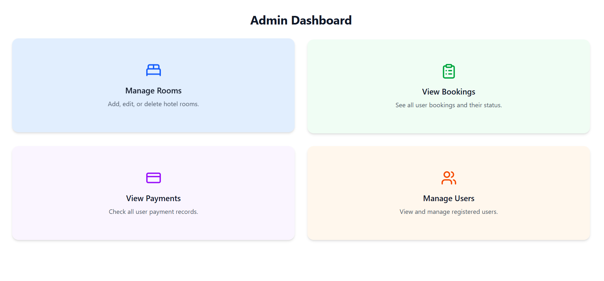

# DeepSea - Hotel Management Web Application


DeepSea is a full-stack hotel management web application built with **React** (frontend) and **Node.js + Express + MongoDB** (backend).

## Motivation
To create a modern hotel booking and management system where users can explore rooms, make bookings, and handle payments, while admins can manage rooms, users, and transactions.

## Why this project
Managing hotel operations manually is inefficient. This project provides a digital solution that is user-friendly and scalable.

## Problem it solves
It allows users to easily browse and book hotel rooms online, while admins can oversee all bookings, users, and payments in one centralized dashboard.

## What I learned
Building this project improved my skills in full-stack development, authentication, routing, REST APIs, and integration between frontend and backend services.

---

## Table of Contents
- [Installation](#installation)
- [Usage](#usage)
- [Features](#features)
- [Screenshots](#screenshots)
- [Credits](#credits)
- [License](#license)

---

## Installation

### Backend
1. Clone the repository and navigate to the backend folder:
    ```bash
    cd backend
    ```
2. Install dependencies:
    ```bash
    npm install
    ```
3. Create a `.env` file with the following variables:
    ```env
    MONGO_URI=your_mongodb_connection_string
    JWT_SECRET=your_secret_key
    ```
4. Start the backend server:
    ```bash
    npm start
    ```
   The backend will run on [http://localhost:8000](http://localhost:8000).

### Frontend
1. Navigate to the frontend folder:
    ```bash
    cd frontend
    ```
2. Install dependencies:
    ```bash
    npm install
    ```
3. Start the development server:
    ```bash
    npm run dev
    ```
   The frontend will run on [http://localhost:5173](http://localhost:5173) or [http://localhost:5174](http://localhost:5174).

---

## Usage
- Users can **sign up, log in, browse rooms, make bookings, and handle payments**.
- Admins can **manage rooms, view all bookings, users, and payments** via the admin dashboard.

---

## Screenshots

| Landing Page | Booking Flow | Admin Dashboard |
|--------------|--------------|----------------|
|  |  |  |

> **Note:** Add your screenshots in `assets/images` with the above file names.

---

## Features
- JWT-based user authentication
- Room browsing and booking system
- Online payment integration
- Admin dashboard for hotel management
- Responsive UI with TailwindCSS

---

## Credits
- **Frontend:** React, React Router, TailwindCSS  
- **Backend:** Node.js, Express, MongoDB, Mongoose  
- **Other Tools:** Axios, JWT, Multer  

---

## License
This project is licensed under the [ISC License](LICENSE).
